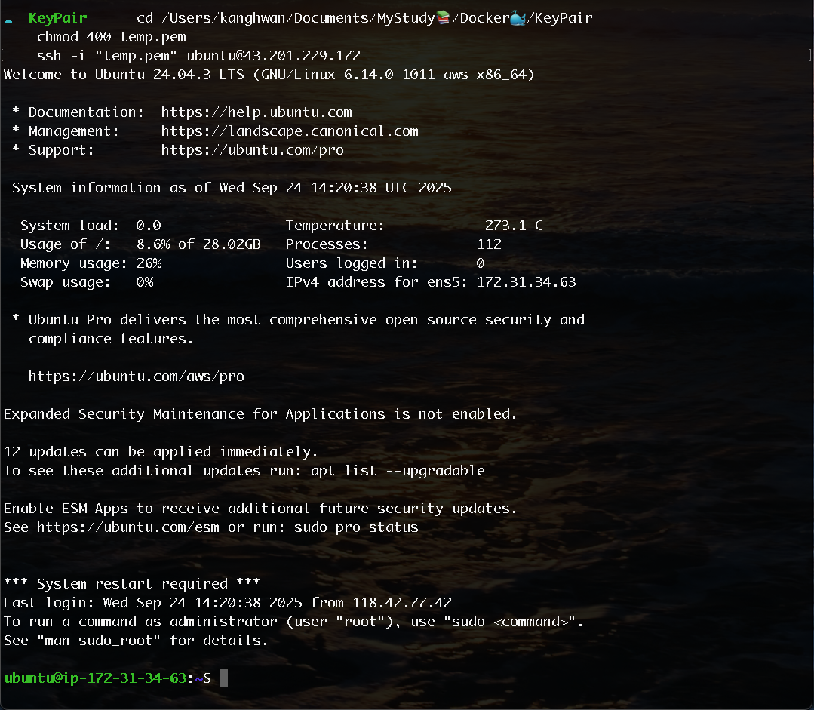
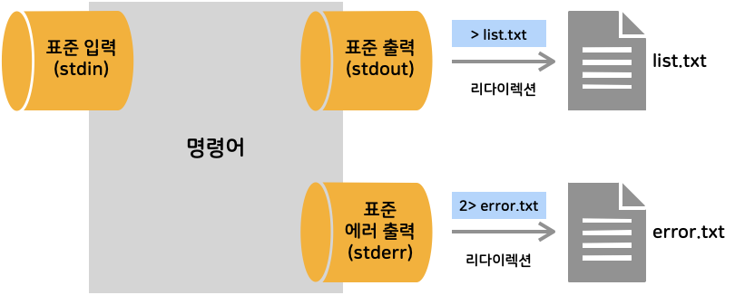

<!-- *NOTE* for write markdown -->

<!-- 
  ## => seciton
  <del>### => chapter in section </del>
  ### => contents in section(chapter)

  🚫#### 헤더는 사용하지 않음 -> 1., 2., 와 같은 리스트로 사용

  📌 섹션으로 구분하며 챕터는 구분하지 않음
  📌 단, 섹션의 하위에 사용되는 학습자료를 적어둠
    ## Section2. 풀스택 큰그림 이해하기
    > [1_understand_fullstack.ipynb](00_MATERIALS/1_understand_fullstack.ipynb "1_understand_fullstack.ipynb")
  📌 학습자료는 00_MATERIALS 폴더에 저장
  📌 이미지는 ref_images 폴더에 저장
  📌 강의 듣는 도중 이해가 되지 않는 기술에 대해서는 포스트 작성
  📌 듣는도중 의견이나 아이디어가 있으면 아래와 같은 comment 작성
    💡 (의견이나 생각) - (강의제목 시간)
    💡 frontend / backend 의 설명이 잘 되어 있음 - 프론트엔드와 백엔드 기본 구성 06:30


★☆☆ : Importance
-->


# Docker 🐳

## Table of Contents
- [Docker 🐳](#docker-)
  - [Table of Contents](#table-of-contents)
  - [Section1. 도커 강의 소개](#section1-도커-강의-소개)
  - [Section2. 배경지식 이해](#section2-배경지식-이해)
    - [DevOps란?](#devops란)
    - [Docker란?](#docker란)
    - [리눅스](#리눅스)
      - [리눅스(Linux) 활용](#리눅스linux-활용)
  - [Section3. 클라우드 서비스(AWS 서버 구축)](#section3-클라우드-서비스aws-서버-구축)
    - [클라우드 컴퓨팅 설정](#클라우드-컴퓨팅-설정)
    - [클라우드 컴퓨팅 설정 - 리눅스 설치](#클라우드-컴퓨팅-설정---리눅스-설치)
  - [Section5. 도커를 위한 리눅스 사용법 요약](#section5-도커를-위한-리눅스-사용법-요약)
    - [리눅스와 파일](#리눅스와-파일)
    - [쉘 종류](#쉘-종류)
    - [다양한 명령어](#다양한-명령어)
    - [chmod : 파일 권한 변경](#chmod--파일-권한-변경)
    - [리눅스 쉘 사용법 이해(리다이렉션/파이프)](#리눅스-쉘-사용법-이해리다이렉션파이프)
      - [Standard Streams](#standard-streams)
      - [리다이렉션(Redirection)](#리다이렉션redirection)
      - [파이프(Pipe)](#파이프pipe)

---
## Section1. 도커 강의 소개

---
## Section2. 배경지식 이해
### DevOps란?
- Release System 자동화
- 코드 리뷰, 테스트 자동화
- 서비스 모니터링 시스템
- 이슈 발생 시 커뮤니케이션 시스템

### Docker란?
- 쿠버네티스(Kubernetes)와 함께 사용
- Jenkins, Travis CI 등과 함께 사용
    - 배포 자동화
- 무중단 배포

### 리눅스
- 1969년: 리눅스의 시작
- 1991년: 리눅스 커널 발표
- 1992년: 첫 번째 리눅스 배포판 등장
- 2000년대: 리눅스의 상업적 성공

#### 리눅스(Linux) 활용 
- 서버에 특화된 운영체제
- 클라우드 컴퓨팅(AWS, GCP, Azure)
    - [AWS](https://aws.amazon.com "Go to url")
    - [GCP](https://cloud.google.com "Go to url")
    - [Azure](https://azure.microsoft.com "Go to url")

- 리눅스 토발즈(Linus Torvalds)가 개발
- GPL(General Public License) 라이선스


## Section3. 클라우드 서비스(AWS 서버 구축)
### 클라우드 컴퓨팅 설정 
- Amazon Web Services (AWS)
    - [https://aws.amazon.com/ko/free/](https://aws.amazon.com/ko/free/ "Go to url")
    - 무료로 12개월 사용 가능 
        - 리눅스 사용 후 계정을 닫으면 됨

- AWS Free Tier 서비스 가입
    - 준비물 
        - 신용카드(해외 결제가 가능한)
        - email 계정

- AWS 서비스
    - EC2 인스턴스 시작

### 클라우드 컴퓨팅 설정 - 리눅스 설치 
1. EC2(서버) 생성 
2. Elastic IP(탄력적 IP, 고정 IP) 생성 
3. 자기 PC에서 EC2(서버) 접속 
    - Windows: **PuTTY** 프로그램 사용 필수, Mac: 터미널
    - Putty 연결방법 : [https://docs.aws.amazon.com/ko_kr/AWSEC2/latest/UserGuide/connect-linux-inst-from-windows.html](https://docs.aws.amazon.com/ko_kr/AWSEC2/latest/UserGuide/connect-linux-inst-from-windows.html "Go to url")

    ```bash
    cd ../path/to/your/.pem/file
    chmod 400 your-key-name.pem
    ssh -i "your-key-name.pem" ubuntu@your-ec2-public-ip
    ```

    > chmod 란?
    > - chmod: Change Mode
    > - 파일이나 디렉토리의 권한을 변경하는 명령어

    **<u>Mac환경 예시</u>**
    ```bash
    cd /Users/kanghwan/Documents/MyStudy📚/Docker🐳/KeyPair
    chmod 400 temp.pem
    ssh -i "temp.pem" ubuntu@43.201.229.172
    # 종료는 exit
    ```


    <p style="text-align: left;">
        
    </p>

## Section5. 도커를 위한 리눅스 사용법 요약
### 리눅스와 파일 
- 모든 것을 파일이라는 철학 
    - 모든 인터렉션은 파일을 읽고, 쓰는 것처럼 동작 

- 파일 네임스페이스 
    - 전역 네임스페이스 사용 
        - / (root) 디렉토리부터 시작

### 쉘 종류 
- Bourne-Again Shell (bash): GNU 프로젝트의 일환으로 개발된 유닉스 셸

### 다양한 명령어 
> 리눅스에는 휴지통이 없음. 삭제 시 복구 불가. 주의!! ⚠️
1. `whoami`: 현재 사용자의 이름을 출력 
    - root: 최고 관리자
2. `sudo`: superuser do 
    - root 권한으로 명령어 실행
    - 사용 예시: `sudo apt-get update`
3. `pwd`: 현재 작업 중인 디렉토리 경로 확인
4. `ls`: 파일/디렉토리 목록 보기
    - 숨김 포함: `ls -la`
    - 한 줄 출력: `ls -1`
    - 재귀 목록: `ls -R`
5. `cd`: 디렉토리 이동
    - 상위로: `cd ..`
    - 홈으로: `cd ~`
6. `touch`, `mkdir`, `rm`
    - 파일 생성: `touch file.txt`
    - 디렉토리 생성(하위 포함): `mkdir -p dir/subdir`
    - 파일 삭제: `rm file.txt`
    - 디렉토리/재귀 삭제: `rm -rf dir/`
        - `-r`: 재귀, `-f`: 강제
7. `cp`, `mv`
    - 파일/폴더 복사: `cp src dst`, 디렉토리 복사: `cp -r src/ dst/`
    - 이동/이름 변경: `mv old new`
8. `cat`, `less`, `head`, `tail`
    - 내용 전체 보기: `cat file.txt`
    - 페이지 단위 보기: `less file.txt` (종료: q)
    - 앞 N줄: `head -n 20 file.txt`
    - 마지막 N줄/실시간: `tail -n 100 -f file.txt`
9. `grep`, `find`: **검색**
    - 텍스트 검색: `grep -n "pattern" file.txt`
    - 디렉토리 전체 검색: `grep -R "pattern" .`
        - <option>
            - `-i`: 대소문자 무시
            - `-v`: 패턴과 일치하지 않는 라인 출력
            - `-c`: 일치하는 라인 수 출력
            - `-l`: 일치하는 파일 이름 출력
            - `-c`: 일치하는 라인 수 출력
            - `-n`: 일치하는 라인 번호 출력
    - 파일 찾기: `find . -type f -name "*.log"`
10. `chmod`, `chown`: 권한/소유자
    - 권한 변경: `chmod 644 file.txt`, 실행권한 추가: `chmod +x script.sh`
    - 소유자 변경: `sudo chown user:group file.txt`
11. `df`, `du`, `free`: 디스크/메모리
    - 디스크 사용량: `df -h`
    - 폴더별 용량: `du -sh ./*`
    - 메모리 사용량: `free -h` (Ubuntu 등)
12. `ps`, `top`, `kill`: 프로세스
    - 프로세스 목록: `ps aux | grep bash`
    - 실시간 모니터링: `top` (또는 `htop` 설치 시)
    - 종료: `kill PID`, 강제 종료: `kill -9 PID`
13. `systemctl`/`service`: 서비스 관리
    - 상태 확인: `sudo systemctl status docker`
    - 시작/중지/재시작: `sudo systemctl start|stop|restart docker`
14. 네트워크 관련
    - IP 확인: `ip a` (또는 `ifconfig`)
    - 연결 확인: `ping -c 4 google.com`
    - 포트/소켓: `ss -lntp` (또는 `netstat -lntp`)
    - HTTP 확인: `curl -I http://localhost:80`
15. 압축/아카이브
    - 만들기: `tar -czf archive.tgz dir/`
    - 풀기: `tar -xzf archive.tgz`
    - zip/unzip: `zip -r archive.zip dir/`, `unzip archive.zip`
16. 패키지 관리
    - Debian/Ubuntu: `sudo apt update && sudo apt install <pkg>`
    - RHEL/CentOS: `sudo yum install <pkg>` (또는 `dnf`)
17. 사용자/그룹
    - 현재 사용자 정보: `id`
    - 사용자 추가: `sudo useradd -m <user>`
    - 비밀번호 설정: `sudo passwd <user>`
18. 시스템 정보
    - 커널/OS: `uname -a`
    - 배포판: `cat /etc/os-release`
19. 환경변수/경로
    - 확인: `echo $PATH`
    - 설정(세션 한정): `export KEY=value`
20. 리다이렉션/파이프
    - 출력 저장: `command > out.txt`, 추가 저장: `command >> out.txt`
    - 결과 연결: `command1 | command2`
21. 파일 목록 추출/저장 팁
    - 현재 디렉토리 파일만: `ls -1 > files.txt`
    - 재귀적으로 전체 파일: `find . -type f > files.txt`
    - 개수 세기: `find . -type f | wc -l`

### chmod : 파일 권한 변경 
<!-- 추가 예시 필요함.. -->
- 숫자를 사용하는 방법 
- 읽기(r)=4, 쓰기(w)=2, 실행(x)=1
- 소유자, 그룹, 기타 사용자 순서로 합산
- 예시: `chmod 755 file.sh` (소유자 rwx(7), 그룹 rx(5), 기타 rx(5))

### 리눅스 쉘 사용법 이해(리다이렉션/파이프)
#### Standard Streams 
- 표준 입력(Standard Input, **stdin**, 0): 키보드 입력
- 표준 출력(Standard Output, **stdout**, 1): 화면 출력
- 표준 에러(Standard Error, **stderr**, 2): 에러 메시지 출력

#### 리다이렉션(Redirection)
- 표준 스트림 흐름 변경
    <p style="text-align: left;">
        
    </p>

- `>`: 표준 출력 리다이렉션 (덮어쓰기)
    - 예시: `command > file.txt` (출력 내용을 file.txt에 저장)
- `>>`: 표준 출력 리다이렉션 (추가쓰기)
    - 예시: `command >> file.txt` (출력 내용을 file.txt에 추가)
- `2>`: 표준 에러 리다이렉션 (덮어쓰기)
    - 예시: `command 2> error.txt` (에러 메시지를 error.txt에 저장)
- `2>>`: 표준 에러 리다이렉션 (추가쓰기)
    - 예시: `command 2>> error.txt` (에러 메시지를 error.txt에 추가)

#### 파이프(Pipe) 
- `|`: 한 명령어의 출력을 다음 명령어의 입력으로 연결
    - 예시: `command1 | command2` (command1의 출력을 command2의 입력으로 사용)


