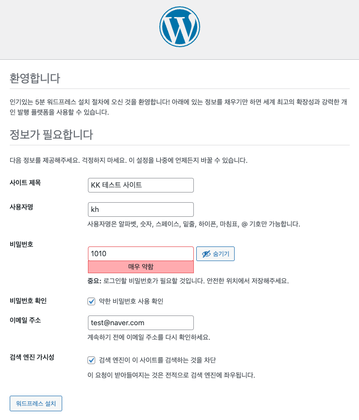
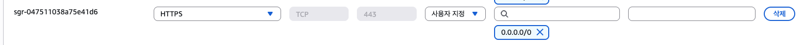
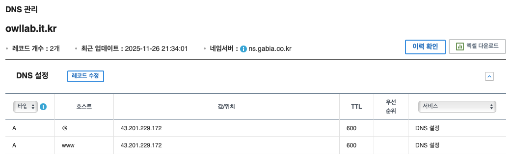
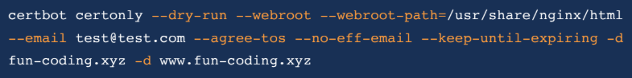

# Docker 🐳

- 구입한 도메인: [www.owllab.it.kr](http://www.owllab.it.kr "Go to url")

> version info  
> ubuntu 24.04.3 LTS  
> docker 28.4.0  
> docker-compose v2.39.4  

> 참고 
> 23강 linux에서 실행 시 aws 인바운드 규칙 설정

## Table of Contents
- [Docker 🐳](#docker-)
  - [Table of Contents](#table-of-contents)
  - [Section1. 도커 강의 소개](#section1-도커-강의-소개)
  - [Section2. 배경지식 이해](#section2-배경지식-이해)
    - [DevOps란?](#devops란)
    - [Docker란?](#docker란)
    - [리눅스](#리눅스)
      - [리눅스(Linux) 활용](#리눅스linux-활용)
  - [Section4. 수업준비](#section4-수업준비)
  - [Section3. 클라우드 서비스(AWS 서버 구축)](#section3-클라우드-서비스aws-서버-구축)
    - [클라우드 컴퓨팅 설정](#클라우드-컴퓨팅-설정)
    - [클라우드 컴퓨팅 설정 - 리눅스 설치](#클라우드-컴퓨팅-설정---리눅스-설치)
  - [Section5. 도커를 위한 리눅스 사용법 요약](#section5-도커를-위한-리눅스-사용법-요약)
    - [리눅스와 파일](#리눅스와-파일)
    - [쉘 종류](#쉘-종류)
    - [다양한 명령어](#다양한-명령어)
    - [chmod : 파일 권한 변경](#chmod--파일-권한-변경)
    - [리눅스 쉘 사용법 이해 - 리다이렉션/파이프](#리눅스-쉘-사용법-이해---리다이렉션파이프)
      - [Standard Streams](#standard-streams)
      - [리다이렉션(Redirection)](#리다이렉션redirection)
      - [파이프(Pipe)](#파이프pipe)
    - [리눅스 쉘 사용법 이해 - 프로세스 관리](#리눅스-쉘-사용법-이해---프로세스-관리)
      - [프로세스 vs 바이너리](#프로세스-vs-바이너리)
      - [foreground / background process](#foreground--background-process)
      - [프로세스 상태 확인 - ps 명령어](#프로세스-상태-확인---ps-명령어)
      - [프로세스 중지](#프로세스-중지)
    - [리눅스 쉘 사용법 이해 - 하드링크와 소프트(심볼릭)링크](#리눅스-쉘-사용법-이해---하드링크와-소프트심볼릭링크)
      - [하드링크와 소프트링크](#하드링크와-소프트링크)
    - [리눅스 쉘 사용법 이해 - 우분투 패키지 매니저](#리눅스-쉘-사용법-이해---우분투-패키지-매니저)
      - [ubuntu 패키지 관리 실무](#ubuntu-패키지-관리-실무)
    - [리눅스 쉘 사용법 이해 - VIM 사용법](#리눅스-쉘-사용법-이해---vim-사용법)
      - [초간단 사용법](#초간단-사용법)
  - [Section6. 리눅스, 맥, 윈도우에서의 도커 환경 구축](#section6-리눅스-맥-윈도우에서의-도커-환경-구축)
    - [Mac / Windows Docker 설치](#mac--windows-docker-설치)
      - [Mac 설치](#mac-설치)
      - [Windows 설치(강의 Section6-16 참조)](#windows-설치강의-section6-16-참조)
    - [Linux Docker 설치](#linux-docker-설치)
      - [설치 방법](#설치-방법)
      - [`sudo` 없이 사용하기](#sudo-없이-사용하기)
    - [Docker compose 설치(Standalone)](#docker-compose-설치standalone)
  - [Section7. docker 주요 명령 익히기](#section7-docker-주요-명령-익히기)
    - [도커에 대한 기본 이해](#도커에-대한-기본-이해)
    - [docker 이미지 기본](#docker-이미지-기본)
    - [docker 주요 명령어 익히기](#docker-주요-명령어-익히기)
    - [Docker Container 관련 주요 명령](#docker-container-관련-주요-명령)
    - [웹서버로 docker run 옵션 테스트해보기](#웹서버로-docker-run-옵션-테스트해보기)
      - [apache 웹서버 도커 이미지 다운로드](#apache-웹서버-도커-이미지-다운로드)
      - [이미지 다운로드받고 바로 컨테이너로 만들어 실행시키기(`-p` 옵션 이해하기)](#이미지-다운로드받고-바로-컨테이너로-만들어-실행시키기-p-옵션-이해하기)
      - [나만의 웹서비스 docker 만들기(`-v` 옵션 이해하기)](#나만의-웹서비스-docker-만들기-v-옵션-이해하기)
      - [alpine 리눅스 기반 경량 웹서버 도커 이미지 사용](#alpine-리눅스-기반-경량-웹서버-도커-이미지-사용)
      - [도커가 사용 중인 디스크 용량 확인](#도커가-사용-중인-디스크-용량-확인)
      - [실행중인 컨테이너 리소스 사용량 확인](#실행중인-컨테이너-리소스-사용량-확인)
      - [실행중인 컨테이너에 명령 실행하기](#실행중인-컨테이너에-명령-실행하기)
      - [모든 컨테이너 삭제](#모든-컨테이너-삭제)
  - [Section8. Dockerfile 사용법 기본](#section8-dockerfile-사용법-기본)
    - [Dockerfile 주요 명령어](#dockerfile-주요-명령어)
    - [Dockerfile로 이미지 작성](#dockerfile로-이미지-작성)
        - [Dockerfile 예시](#dockerfile-예시)
      - [주요 옵션](#주요-옵션)
    - [Docker Image 조사(`docker inspect`)](#docker-image-조사docker-inspect)
    - [Docker 가끔 사용하는 기타 명령어들](#docker-가끔-사용하는-기타-명령어들)
    - [`ENTRYPOINT`](#entrypoint)
    - [`EXPOSE`](#expose)
    - [`ENV` : 환경 변수 설정](#env--환경-변수-설정)
    - [`WORKDIR`: 작업 디렉토리 설정](#workdir-작업-디렉토리-설정)
    - [Docker DB 설정 예시](#docker-db-설정-예시)
  - [Section9. 도커 활용을 위한 추가 명령 익히기](#section9-도커-활용을-위한-추가-명령-익히기)
    - [Docker 간단 명령어 정리](#docker-간단-명령어-정리)
      - [`docker history`: 이미지 생성 이력 확인](#docker-history-이미지-생성-이력-확인)
      - [`docker cp`: 컨테이너와 호스트 간 파일 복사](#docker-cp-컨테이너와-호스트-간-파일-복사)
      - [`docker commit`: 컨테이너 변경사항을 이미지로 저장](#docker-commit-컨테이너-변경사항을-이미지로-저장)
      - [`docker diff`: 컨테이너와 이미지 간 변경사항 확인](#docker-diff-컨테이너와-이미지-간-변경사항-확인)
      - [`docker inspect`: 이미지/컨테이너 상세 정보 확인](#docker-inspect-이미지컨테이너-상세-정보-확인)
      - [`docker logs`: 컨테이너 로그 확인](#docker-logs-컨테이너-로그-확인)
    - [컨테이너 활용과 연결](#컨테이너-활용과-연결)
      - [docker로 jupyter notebook 띄우기](#docker로-jupyter-notebook-띄우기)
  - [Section10. Docker Compose 사용법 기본](#section10-docker-compose-사용법-기본)
    - [Docker Compose 작성 기본](#docker-compose-작성-기본)
      - [version](#version)
      - [services](#services)
      - [image](#image)
      - [volumes](#volumes)
      - [restart](#restart)
      - [environment](#environment)
      - [ports](#ports)
    - [Docker Compose 실행 / 중지 하기](#docker-compose-실행--중지-하기)
      - [Docker Compose 실행 명령 : `docker-compose up`](#docker-compose-실행-명령--docker-compose-up)
      - [Docker Compose 중지 명령 : `docker-compose stop`](#docker-compose-중지-명령--docker-compose-stop)
      - [Docker Compose 에서 사용하는 컨테이너 삭제 명령 : `docker-compose down`](#docker-compose-에서-사용하는-컨테이너-삭제-명령--docker-compose-down)
    - [Docker Compose YAML 추가 옵션들](#docker-compose-yaml-추가-옵션들)
      - [05\_docker-compose.pdf - docker-compose.yml 예로 이해하는 Docker Compose 사용법2 참고](#05_docker-composepdf---docker-composeyml-예로-이해하는-docker-compose-사용법2-참고)
      - [주요 옵션 설명](#주요-옵션-설명)
      - [기타 유용한 Docker Compose 명령어](#기타-유용한-docker-compose-명령어)
      - [예시](#예시)
  - [Section11. 웹서버 이해와 도커로 웹서버 구축](#section11-웹서버-이해와-도커로-웹서버-구축)
    - [웹서버](#웹서버)
    - [Apache vs Nginx](#apache-vs-nginx)
    - [Nginx 기본 사용법](#nginx-기본-사용법)
    - [default 파일의 server 설정](#default-파일의-server-설정)
  - [Section12. nginx 웹서버로 Reverse Proxy 도커 구축하기](#section12-nginx-웹서버로-reverse-proxy-도커-구축하기)
    - [Nginx Reverse Proxy](#nginx-reverse-proxy)
      - [Proxy 서버란?](#proxy-서버란)
      - [Reverse Proxy 란?](#reverse-proxy-란)
    - [nginx reverse proxy 테스트1: 포트로 구분](#nginx-reverse-proxy-테스트1-포트로-구분)
    - [nginx reverse proxy 테스트2: 경로로 구분](#nginx-reverse-proxy-테스트2-경로로-구분)
    - [nginx reverse proxy 테스트3: 경로로 구분(내부 서버에 요청하는 경로 변경하기)](#nginx-reverse-proxy-테스트3-경로로-구분내부-서버에-요청하는-경로-변경하기)
      - [rewrite 지시어 사용법](#rewrite-지시어-사용법)
    - [참고 - nginx 설정](#참고---nginx-설정)
      - [에러페이지 설정](#에러페이지-설정)
      - [캐쉬 설정](#캐쉬-설정)
  - [Section13. 클론코딩 - 실제 서비스 구축하기](#section13-클론코딩---실제-서비스-구축하기)
    - [워드프레스란?](#워드프레스란)
    - [워드프레스 설치방법](#워드프레스-설치방법)
    - [워드프레스 도커파일 작성하기](#워드프레스-도커파일-작성하기)
  - [Section14. HTTPS 지원 중급레벨 서비스 구축하기](#section14-https-지원-중급레벨-서비스-구축하기)
    - [HTTPS 지원](#https-지원)
      - [사전준비](#사전준비)
      - [certbot 와 nginx 기본 설정](#certbot-와-nginx-기본-설정)
      - [인증서 발급 확인](#인증서-발급-확인)
      - [HTTPS로 영구적 리다이렉트 설정](#https로-영구적-리다이렉트-설정)
      - [nginx.conf 수정 예시](#nginxconf-수정-예시)
      - [인증서 갱신(feat. crontab)⭐️](#인증서-갱신feat-crontab️)


<style>
    .hl { background-color: #acd3f0ff; padding: 1px 6px; border-radius: 3px; color: #000000; }
    .hl-title { background-color: #acd3f0ff; padding: 3px 6px; border-radius: 10px; color: #000000; }
    .hl-yellow { background-color: #FFF2CC; padding: 1px 6px; border-radius: 3px; }
    .hl-blue { background-color: #CCE5FF; padding: 1px 6px; border-radius: 3px; }
    .hl-green { background-color: #D5E8D4; padding: 1px 6px; border-radius: 3px; }
    .hl-pink { background-color: #FFE6E6; padding: 1px 6px; border-radius: 3px; }
    code { background-color: #f5f5f5; padding: 2px 4px; border-radius: 3px; }
    
    /* 헤더 넘버링 */
    body { counter-reset: h2; }
    h2 { counter-reset: h3; counter-increment: h2; }
    h3 { counter-reset: h4; counter-increment: h3; }
    h4 { counter-reset: h5; counter-increment: h4; }
    h5 { counter-reset: h6; counter-increment: h5; }
    h6 { counter-increment: h6; }
    
    h2:before { content: counter(h2) ". "; }
    h3:before { content: counter(h2) "." counter(h3) ". "; }
    h4:before { content: counter(h2) "." counter(h3) "." counter(h4) ". "; }
    h5:before { content: counter(h2) "." counter(h3) "." counter(h4) "." counter(h5) ". "; }
    h6:before { content: counter(h2) "." counter(h3) "." counter(h4) "." counter(h5) "." counter(h6) ". "; }
    
    /* Table of Contents에는 넘버링 제외 */
    h2:first-of-type:before { content: ""; }
    h2:first-of-type { counter-increment: none; }
    
    /* Table of Contents 하위 항목들도 넘버링 제외 */
    h2:first-of-type ~ ul h3:before,
    h2:first-of-type ~ ul h4:before,
    h2:first-of-type ~ ul h5:before,
    h2:first-of-type ~ ul h6:before { content: ""; }

</style>

---
## Section1. 도커 강의 소개

---
## Section2. 배경지식 이해
### DevOps란?
- Release System 자동화
- 코드 리뷰, 테스트 자동화
- 서비스 모니터링 시스템
- 이슈 발생 시 커뮤니케이션 시스템

### Docker란?
- 쿠버네티스(Kubernetes)와 함께 사용
- Jenkins, Travis CI 등과 함께 사용
    - 배포 자동화
- 무중단 배포

### 리눅스
- 1969년: 리눅스의 시작
- 1991년: 리눅스 커널 발표
- 1992년: 첫 번째 리눅스 배포판 등장
- 2000년대: 리눅스의 상업적 성공

#### 리눅스(Linux) 활용 
- 서버에 특화된 운영체제
- 클라우드 컴퓨팅(AWS, GCP, Azure)
    - [AWS](https://aws.amazon.com "Go to url")
    - [GCP](https://cloud.google.com "Go to url")
    - [Azure](https://azure.microsoft.com "Go to url")

- 리눅스 토발즈(Linus Torvalds)가 개발
- GPL(General Public License) 라이선스

## Section4. 수업준비

## Section3. 클라우드 서비스(AWS 서버 구축)
### 클라우드 컴퓨팅 설정 
- Amazon Web Services (AWS)
    - [https://aws.amazon.com/ko/free/](https://aws.amazon.com/ko/free/ "Go to url")
    - 무료로 12개월 사용 가능 
        - 리눅스 사용 후 계정을 닫으면 됨

- AWS Free Tier 서비스 가입
    - 준비물 
        - 신용카드(해외 결제가 가능한)
        - email 계정

- AWS 서비스
    - EC2 인스턴스 시작

### 클라우드 컴퓨팅 설정 - 리눅스 설치 
1. EC2(서버) 생성 
2. Elastic IP(탄력적 IP, 고정 IP) 생성 
3. 자기 PC에서 EC2(서버) 접속 
    - Windows: **PuTTY** 프로그램 사용 필수, Mac: 터미널
    - Putty 연결방법 : [https://docs.aws.amazon.com/ko_kr/AWSEC2/latest/UserGuide/connect-linux-inst-from-windows.html](https://docs.aws.amazon.com/ko_kr/AWSEC2/latest/UserGuide/connect-linux-inst-from-windows.html "Go to url")

    ```bash
    cd ../path/to/your/.pem/file
    chmod 400 your-key-name.pem
    ssh -i "your-key-name.pem" ubuntu@your-ec2-public-ip
    ```

    > chmod 란?
    > - chmod: Change Mode
    > - 파일이나 디렉토리의 권한을 변경하는 명령어

    **<u>Mac환경 예시</u>**
    ```bash
    cd /Users/kanghwan/Documents/MyStudy📚/Docker🐳/KeyPair
    chmod 400 temp.pem
    ssh -i "temp.pem" ubuntu@43.201.229.172
    # 종료는 exit
    ```


    <p style="text-align: left;">
        
    </p>

## Section5. 도커를 위한 리눅스 사용법 요약
### 리눅스와 파일 
- 모든 것을 파일이라는 철학 
    - 모든 인터렉션은 파일을 읽고, 쓰는 것처럼 동작 

- 파일 네임스페이스 
    - 전역 네임스페이스 사용 
        - / (root) 디렉토리부터 시작

### 쉘 종류 
- Bourne-Again Shell (bash): GNU 프로젝트의 일환으로 개발된 유닉스 셸

### 다양한 명령어 
> 리눅스에는 휴지통이 없음. 삭제 시 복구 불가. 주의!! ⚠️
1. `whoami`: 현재 사용자의 이름을 출력 
    - root: 최고 관리자
2. `sudo`: superuser do 
    - root 권한으로 명령어 실행
    - 사용 예시: `sudo apt-get update`
3. `pwd`: 현재 작업 중인 디렉토리 경로 확인
4. `ls`: 파일/디렉토리 목록 보기
    - 숨김 포함: `ls -la`
    - 한 줄 출력: `ls -1`
    - 재귀 목록: `ls -R`
5. `cd`: 디렉토리 이동
    - 상위로: `cd ..`
    - 홈으로: `cd ~`
6. `touch`, `mkdir`, `rm`
    - 파일 생성: `touch file.txt`
    - 디렉토리 생성(하위 포함): `mkdir -p dir/subdir`
    - 파일 삭제: `rm file.txt`
    - 디렉토리/재귀 삭제: `rm -rf dir/`
        - `-r`: 재귀, `-f`: 강제
7. `cp`, `mv`
    - 파일/폴더 복사: `cp src dst`, 디렉토리 복사: `cp -r src/ dst/`
    - 이동/이름 변경: `mv old new`
8. `cat`, `less`, `head`, `tail`
    - 내용 전체 보기: `cat file.txt`
    - 페이지 단위 보기: `less file.txt` (종료: q)
    - 앞 N줄: `head -n 20 file.txt`
    - 마지막 N줄/실시간: `tail -n 100 -f file.txt`
9. `grep`, `find`: **검색**
    - 텍스트 검색: `grep -n "pattern" file.txt`
    - 디렉토리 전체 검색: `grep -R "pattern" .`
        - <option>
            - `-i`: 대소문자 무시
            - `-v`: 패턴과 일치하지 않는 라인 출력
            - `-c`: 일치하는 라인 수 출력
            - `-l`: 일치하는 파일 이름 출력
            - `-c`: 일치하는 라인 수 출력
            - `-n`: 일치하는 라인 번호 출력
    - 파일 찾기: `find . -type f -name "*.log"`
10. `chmod`, `chown`: 권한/소유자
    - 권한 변경: `chmod 644 file.txt`, 실행권한 추가: `chmod +x script.sh`
    - 소유자 변경: `sudo chown user:group file.txt`
11. `df`, `du`, `free`: 디스크/메모리
    - 디스크 사용량: `df -h`
    - 폴더별 용량: `du -sh ./*`
    - 메모리 사용량: `free -h` (Ubuntu 등)
12. `ps`, `top`, `kill`: 프로세스
    - 프로세스 목록: `ps aux | grep bash`
    - 실시간 모니터링: `top` (또는 `htop` 설치 시)
    - 종료: `kill PID`, 강제 종료: `kill -9 PID`
13. `systemctl`/`service`: 서비스 관리
    - 상태 확인: `sudo systemctl status docker`
    - 시작/중지/재시작: `sudo systemctl start|stop|restart docker`
14. 네트워크 관련
    - IP 확인: `ip a` (또는 `ifconfig`)
    - 연결 확인: `ping -c 4 google.com`
    - 포트/소켓: `ss -lntp` (또는 `netstat -lntp`)
    - HTTP 확인: `curl -I http://localhost:80`
15. 압축/아카이브
    - 만들기: `tar -czf archive.tgz dir/`
    - 풀기: `tar -xzf archive.tgz`
    - zip/unzip: `zip -r archive.zip dir/`, `unzip archive.zip`
16. 패키지 관리
    - Debian/Ubuntu: `sudo apt update && sudo apt install <pkg>`
    - RHEL/CentOS: `sudo yum install <pkg>` (또는 `dnf`)
17. 사용자/그룹
    - 현재 사용자 정보: `id`
    - 사용자 추가: `sudo useradd -m <user>`
    - 비밀번호 설정: `sudo passwd <user>`
18. 시스템 정보
    - 커널/OS: `uname -a`
    - 배포판: `cat /etc/os-release`
19. 환경변수/경로
    - 확인: `echo $PATH`
    - 설정(세션 한정): `export KEY=value`
20. 리다이렉션/파이프
    - 출력 저장: `command > out.txt`, 추가 저장: `command >> out.txt`
    - 결과 연결: `command1 | command2`
21. 파일 목록 추출/저장 팁
    - 현재 디렉토리 파일만: `ls -1 > files.txt`
    - 재귀적으로 전체 파일: `find . -type f > files.txt`
    - 개수 세기: `find . -type f | wc -l`

### chmod : 파일 권한 변경 
<!-- 추가 예시 필요함.. -->
- 숫자를 사용하는 방법 
- 읽기(r)=4, 쓰기(w)=2, 실행(x)=1
- 소유자, 그룹, 기타 사용자 순서로 합산
- 예시: `chmod 755 file.sh` (소유자 rwx(7), 그룹 rx(5), 기타 rx(5))

### 리눅스 쉘 사용법 이해 - 리다이렉션/파이프
#### Standard Streams 
- 표준 입력(Standard Input, **stdin**, 0): 키보드 입력
- 표준 출력(Standard Output, **stdout**, 1): 화면 출력
- 표준 에러(Standard Error, **stderr**, 2): 에러 메시지 출력

#### 리다이렉션(Redirection)
- 표준 스트림 흐름 변경
    <p style="text-align: left;">
        
    </p>

- `>`: 표준 출력 리다이렉션 (덮어쓰기)
    - 예시: `command > file.txt` (출력 내용을 file.txt에 저장)
- `>>`: 표준 출력 리다이렉션 (추가쓰기)
    - 예시: `command >> file.txt` (출력 내용을 file.txt에 추가)
- `2>`: 표준 에러 리다이렉션 (덮어쓰기)
    - 예시: `command 2> error.txt` (에러 메시지를 error.txt에 저장)
- `2>>`: 표준 에러 리다이렉션 (추가쓰기)
    - 예시: `command 2>> error.txt` (에러 메시지를 error.txt에 추가)

#### 파이프(Pipe) 
- `|`: 한 명령어의 출력을 다음 명령어의 입력으로 연결
    - 예시: `command1 | command2` (command1의 출력을 command2의 입력으로 사용)

### 리눅스 쉘 사용법 이해 - 프로세스 관리
#### 프로세스 vs 바이너리 
- 코드 이미지 또는 바이너리 : 실행파일(`.exe` 등)
- 실행 중인 프로그램 : 프로세스 

#### foreground / background process 
- foreground: 터미널에서 직접 실행, 종료 시까지 터미널 점유
- background: 터미널에서 실행 후 백그라운드로 전환, 터미널 점유하지 않음
    - `&` 기호 사용: `command &`
        ```bash
        sleep 100 &
        # [1] 12345
        # [1]: 작업 번호, 12345: 프로세스 ID (PID)  
        ```
    - `jobs` 명령어로 백그라운드 작업 확인

#### 프로세스 상태 확인 - ps 명령어 
- 사용법 : ps [options(s)]
- options(s)
    - `a`: 터미널에 속하지 않은 프로세스 포함
    - `u`: 사용자 중심의 상세 정보 출력
    - `x`: 터미널에 속하지 않은 프로세스 포함
    - `l`: 긴 형식의 자세한 정보 출력 
    - `-e` or `-A`: 모든 프로세스 표시
    - `-f`: 프로세스 간 관계 정보도 출력

- 주요 ps 출력 정보 항목
    - USER: 프로세스 소유자
    - PID: 프로세스 ID
    - %CPU: CPU 사용률
    - %MEM: 메모리 사용률
    - VSZ: 가상 메모리 크기 (KB) 
    - RSS: 실제 메모리 사용량 (KB) 
    - STAT: 프로세스 상태
        - R: 실행 중 (Running)
        - S: 대기 중 (Sleeping)
        - D: 중단 불가능한 대기 (Uninterruptible Sleep)
        - T: 중지됨 (Stopped)
        - Z: 좀비 프로세스 (Zombie)
    - START: 프로세스 시작 시간 
    - TIME: 현재까지 사용된 CPU 사용 시간
    - COMMAND: 실행된 명령어

#### 프로세스 중지 
- `kill` 명령어로 프로세스 종료
    - 사용법: `kill [signal] PID`
    - 주요 signal
        - `SIGTERM (15)`: 정상 종료 요청 (기본값)
        - `SIGKILL (9)`: 강제 종료
        - `SIGSTOP (19)`: 일시 중지
        - `SIGCONT (18)`: 중지된 프로세스 재개
    - 예시: `kill -9 12345` (PID 12345 프로세스를 강제 종료)

### 리눅스 쉘 사용법 이해 - 하드링크와 소프트(심볼릭)링크
#### 하드링크와 소프트링크 
- cp 명령 : 파일 복사
    - 하위 폴더 포함 복사: `cp -rf src/ dst/`
- 하드링크 : in A B 
    - 생성: `ln source_file link_name`
    - A가 변경되면 B도 변경
- **소프트(심볼릭)링크** : in -s A B
    - 생성: `ln -s source_file link_name`
    - Windows OS의 바로가기와 동일
    - `ls -al` 명령어로 링크 확인
        - 하드링크: 동일한 inode 번호
        - 소프트링크: 다른 inode 번호, `->`로 원본 파일 표시
            ```bash
            lrwxrwxrwx 1 user user 20 Oct 10 12:00 symlink.txt -> original.txt
            ```

### 리눅스 쉘 사용법 이해 - 우분투 패키지 매니저
#### ubuntu 패키지 관리 실무 
- 패키지 인덱스 정보 업데이트
    - `sudo apt-get update`
- 패키지 업그레이드 ⬅️ 패키지 업그레이드는 완전 주의 필요 ⚠️
    - `sudo apt-get upgrade`
- 패키지 설치 
    - `sudo apt-get install <package_name>`
- 패키지 제거
    - `sudo apt-get remove <package_name>`
- 패키지 제거(설정 파일 포함)
    - `sudo apt-get --purge remove <package_name>`

### 리눅스 쉘 사용법 이해 - VIM 사용법
#### 초간단 사용법 
- 입력 : `i` (insert 모드)
- 저장 : `:w` (write)
- 종료 : `:q` (quit)
- 강제 종료 : `:q!` (quit without saving)
- 저장 후 종료 : `:wq` or `:x`

## Section6. <span class='hl-title'>리눅스, 맥, 윈도우에서의 도커 환경 구축</span>

> 📕 PDF
> - [x] [01_docker_start.pdf](https://drive.google.com/file/d/1k9ncifj3-oA-kuMzbq6GsLk3ycoVwO71/view?usp=drive_link "01_docker_start.pdf")

### Mac / Windows Docker 설치
#### Mac 설치  
- `Docker for mac` 검색 후 설치 - 간단

#### Windows 설치(강의 Section6-16 참조)
> Windows 설치는 추천하지 않음
- Dos 및 Hiper-v 기능 활성화 필요 
- **Windows 10 Pro 이상에서만 가능**
    - `Docker for Windows` 검색 후 설치 - 간단

### Linux Docker 설치
#### 설치 방법
> 공식 페이지 참조 : [https://docs.docker.com/engine/install/ubuntu/](https://docs.docker.com/engine/install/ubuntu/ "Go to url")

1. old version 삭제
2. package 설치 
3. 설치 완료되면 아래 명령어로 확인

    ```bash 
    sudo docker run hello-world
    ```

#### `sudo` 없이 사용하기   
1. `sudo` 없이 사용하려면 아래 명령어로 현재 사용자에게 docker 그룹 권한 부여
    ```bash
    sudo usermod -aG docker $USER
    ```
    > 명령어 입력 후 터미널 재시작 필요


2. `id -nG` 명령어로 현재 사용자가 속한 그룹 확인 가능
    
### Docker compose 설치(Standalone)
> 설치방법 : [https://docs.docker.com/compose/install/standalone/](https://docs.docker.com/compose/install/standalone/ "Go to url")

1. 다운로드
    - `curl -SL https://github.com/docker/compose/releases/download/v2.39.4/docker-compose-linux-x86_64 -o /usr/local/bin/docker-compose`
    - failed가 뜬다면 명령어 앞에 `sudo` 붙여서 실행
        - `sudo curl -SL ...`
2. 실행 권한 변경
    ```bash
    sudo chmod +x /usr/local/bin/docker-compose
    ```

## Section7. docker 주요 명령 익히기
> 📕 PDF
> - [x] [01_docker_start.pdf](https://drive.google.com/file/d/1k9ncifj3-oA-kuMzbq6GsLk3ycoVwO71/view?usp=drive_link "01_docker_start.pdf")

### 도커에 대한 기본 이해
1. docker는 서버/클라이언트 구조
    - docker daemon process(서버): 도커 엔진, 백그라운드에서 실행
    - docker command(클라이언트): 사용자가 명령어 입력

2. docker image 
    - docker 컨테이너를 실행하기 위한 명령들을 가진 <span class='hl'>템플릿</span>
    - 여러 이미지들을 layer로 쌓아서, 원하는 형태의 이미지를 만드는 것이 일반적임

3. docker container
    - docker image가 리눅스 컨테이너를 실행하기 위한 <span class='hl'>인스턴스</span>
    - docker image에 포함된 명령을 실행하여, docker container를 생성
    - 컨테이너는 격리된 환경에서 실행되며, 독립적으로 동작
    - 컨테이너는 일시적이며, 필요에 따라 생성

### docker 이미지 기본
1. 주요 단계
    - docker 설치 
    - docker image 다운로드 
        1. docker hub 가입 : [https://hub.docker.com/](https://hub.docker.com/ "Go to url")
        2. `docker login`: 도커 허브 로그인
        3. `docker search --limit=5 이미지이름` : 이미지 검색
        4. OFFICIAL [OK] : 공식 이미지
        5. `ubuntu/squid` : `/` 앞에는 사용자명, 뒤에는 이미지명
        6. 특정 이미지의 태그 리스트 확인은 CLI상으로는 불가능 
            - 웹사이트에서 확인 가능
        7. `docker pull <이미지명>:<태그명>`: 도커 이미지 다운로드
        8. `docker images`: 다운로드 받은 도커 이미지 목록 확인
        9. `docker image ls -q`: **이미지 ID만 출력**

    - 다운로드 받은 image로 docker container 생성 및 실행

2. 명령어 주요 형태 
    - `docker 명령 옵션 선택자(이미지ID/컨테이너등)`

### docker 주요 명령어 익히기
- `docker run`: 도커 컨테이너 생성  및 실행
- `docker ps`: 실행 중인 컨테이너 목록 확인
- `docker stop`: 실행 중인 컨테이너 중지
- `docker rm`: 중지된 컨테이너 삭제
- `docker rmi`: 도커 이미지 삭제

### Docker Container 관련 주요 명령

1. 도커 컨테이너 생성 
    - `docker create <이미지명>:<태그명>`
    - `docker create ubuntu`
    - `docker create --name my_ubuntu ubuntu` : 컨테이너 이름 지정

2. 생성된 컨테이너 확인 
    - `docker ps -a`
    - `docker ps` : 실행 중인 컨테이너만 확인
    - `docker ps -a -q` : 컨테이너 ID만 출력

3. 컨테이너 실행
    - `docker start <컨테이너ID or 이름>`

4. **docker run** 명령 : 컨테이너 생성 후 실행
    - `docker run <옵션> <이미지명>:<태그명>`
    - <span class='hl'>주요 옵션</span>

        | 옵션     | 설명                                               |
        | -------- | -------------------------------------------------- |
        | `-i`     | interactive, 표준 입력 유지                        |
        | `-t`     | tty, 가상 터미널 할당                              |
        | `-it`    | interactive + tty, 터미널 접속                     |
        | `--name` | 컨테이너 이름 지정                                 |
        | `-d`     | detached, 백그라운드 실행                          |
        | `--rm`   | 컨테이너 종료 시 자동 삭제                         |
        | `-p`     | 호스트와 컨테이너 포트를 연결하는 옵션             |
        | `-v`     | 호스트와 컨테이너 간 디렉토리/파일을 연결하는 옵션 |

        > * pseudo tty?
        > tty(teletypewriter): 리눅스(Unix)에서 터미널을 의미 

    - 예시
        - `docker run -it --name my_ubuntu ubuntu`
        - `docker run -it --rm ubuntu` : 종료 시 컨테이너 자동 삭제
        - `docker run -it -d --name my_ubuntu ubuntu` : <span class='hl'>백그라운드 실행</span>

5. 컨테이너 접속 
    - `docker exec -it <컨테이너ID or 이름> /bin/bash`
    - `docker attach <컨테이너ID or 이름>` : 실행 중인 컨테이너에 연결

6. 컨테이너 종료 
    - <span class='hl'>컨테이너 종료</span>하기 

        ```
        docker stop <컨테이너ID or 이름>
        ```

        > (참고)실행 중인 컨테이너 잠깐 멈추기 
        > - `docker pause <컨테이너ID or 이름>`
        > - 잘 사용되지 않음
    
    - 종료된 컨테이너 <span class='hl'>다시 실행</span>

        ```
        docker start <컨테이너ID or 이름>
        ```

### 웹서버로 docker run 옵션 테스트해보기

- 웹서버는 크게 두가지 프로그램으로 구성
    - 웹서버 프로그램 : apache, nginx
- apache 웹서버 도커 이미지 사용
    - 이미지명 : `httpd`
    - 태그명 : `latest` (최신버전)

#### apache 웹서버 도커 이미지 다운로드 
```bash
docker search httpd:latest --limit=5
```

#### 이미지 다운로드받고 바로 컨테이너로 만들어 실행시키기(`-p` 옵션 이해하기)
1. 실행

    - <span class='hl-yellow'>docker run -dit --name {컨테이너이름} {이미지명}</span>

    ```bash
    docker run -dit --name appacheweb httpd
    ```

2. Private IP 변환(NAPT Network Address Port Translation 기술)
    - `-p` 옵션 사용
    - `docker run -dit -p 9999:80 --name appacheweb httpd`
    - `9999`: 호스트 포트, `80`: 컨테이너 포트

    > localhost:9999 으로 접속 시 컨테이너의 80포트로 접속됨
    
#### 나만의 웹서비스 docker 만들기(`-v` 옵션 이해하기)
- FTP(파일 전송 프로토콜) : <span class='hl'>FileZilla 등으로 EC2 서버에 HTML 파일 업로드</span>
- 호스트와 컨테이너 간 디렉토리/파일을 연결하는 옵션

```bash
docker run -dit -p 80:80 -v /home/ubuntu/index_html_test:/usr/local/apache2/htdocs --name my_apache_web httpd
```

#### alpine 리눅스 기반 <span class='hl'>경량 웹서버</span> 도커 이미지 사용
- 태그명 : `alpine` (경량 버전)

```bash
docker run -dit -p 80:80 -v /home/ubuntu/index_html_test:/usr/local/apache2/htdocs --name my_apache_web httpd:alpine
```

#### 도커가 사용 중인 디스크 용량 확인

```bash
docker system df
```

```bash
TYPE            TOTAL     ACTIVE    SIZE      RECLAIMABLE
Images          1         1         64.63MB   0B (0%)
Containers      1         1         2B        0B (0%)
Local Volumes   0         0         0B        0B
Build Cache     0         0         0B        0B
```

#### 실행중인 컨테이너 리소스 사용량 확인

```bash 
docker stats
```

> ctrl + c 로 종료

#### 실행중인 컨테이너에 명령 실행하기

- 사용되는 이미지의 터미널 접속 : /bin/bash<span class='hl'>(일반 apache)</span> or /bin/sh<span class='hl'>(alpine apache)</span>

```bash
docker exec -it my_apache_web /bin/sh
```

#### <span class='hl'>모든 컨테이너 삭제</span>

```bash
docker stop $(docker ps -a -q)
docker rm $(docker ps -a -q)
docker rmi $(docker images -q)
```

## Section8. Dockerfile 사용법 기본

> 📕 PDF
> - [x] [02_docker_dockerfile.pdf](https://drive.google.com/file/d/1gvH1gVAhmYRk6laqEMD-lwMTMeL9NL2G/view?usp=sharing "02_docker_dockerfile.pdf")

### <span class='hl'>Dockerfile 주요 명령어</span>
| 명령어       | 설명                                                                 |
| ------------ | -------------------------------------------------------------------- |
| `FROM`       | 베이스 이미지 지정(예: `FROM ubuntu:latest`)                         |
| `LABEL`      | 이미지에 메타데이터 추가(`inspect`에 포함되는 정보)                  |
| `CMD`        | 컨테이너 실행 시 기본으로 실행될 명령어 지정                         |
| `RUN`        | 이미지 빌드 시 실행할 명령어                                         |
| `ENTRYPOINT` | 컨테이너 시작 시 실행될 명령어 지정                                  |
| `EXPOSE`     | 컨테이너가 수신할 포트 지정                                          |
| `ENV`        | 환경 변수 설정                                                       |
| `WORKDIR`    | 작업 디렉토리 설정                                                   |
| `COPY`       | 파일/디렉토리를 이미지에 복사<br>(도커파일이 위치한 상대경로로 작성) |


### Dockerfile로 이미지 작성 

- Dockerfile: 도커 이미지를 자동으로 빌드하기 위한 설정 파일
- [Dockerfile](#dockerfile-예시) 작성 후, `docker build` 명령어로 이미지 생성

```bash 
docker build -t <이미지명>:<태그명> <Dockerfile이 있는 경로>
# 예시
docker build -t my_apache_image:1.0 ./
```

##### Dockerfile 예시
```bash
# 문서에 대해 설명을 하기 위한
LABEL maintainer="star2kis@nate.com"
# Base 이미지 지정
FROM httpd:alpine

# 문서에 대해 설명을 하기 위한
LABEL maintainer="star2kis@nate.com"
LABEL version="1.0.0"
LABEL description="A test docker image to understand Docker"

# 상대경로로 작성
COPY ./index_html_test /usr/local/apache2/htdocs

# CMD
CMD ["/bin/sh", "-c", "httpd-foreground"]

# ENTRYPOINT
ENTRYPOINT ["/usr/local/bin/httpd-foreground"]
```

#### 주요 옵션
| 옵션          | 설명                                                      |
| ------------- | --------------------------------------------------------- |
| `-t`          | 이미지 이름과 태그 지정                                   |
| `-f`          | Dockerfile 경로 지정(지정하지 않으면 `./Dockerfile` 참조) |
| `--pull=true` | 이미지 생성 시 마다 새로 다운로드                         |

### Docker Image 조사(`docker inspect`)

```bash
docker inspect <이미지ID or 이름>
```

### Docker 가끔 사용하는 기타 명령어들 
- `docker logs <컨테이너ID or 이름>`: 컨테이너 로그 확인
- `docker kill <컨테이너ID or 이름>`: 실행 중인 컨테이너 강제 종료

### `ENTRYPOINT`
- 컨테이너 시작 시 실행될 명령어를 지정
- `CMD`와 함께 사용되며, `CMD`는 기본 인수로 전달됨
- 예시: `ENTRYPOINT ["/usr/local/bin/httpd-foreground"]`

### `EXPOSE`
- 컨테이너가 수신할 포트를 지정
- 예시: `EXPOSE 80`

``` bash
"ExposedPorts": {"80/tcp": {}},
```

### `ENV` : 환경 변수 설정

- 컨테이너 내에서 사용할 환경 변수를 설정

```bash
FROM mysql:latest

ENV MYSQL_ROOT_PASSWORD=password
ENV MYSQL_DATABASE=dbname
```


### `WORKDIR`: 작업 디렉토리 설정 
- 컨테이너 내에서 작업할 디렉토리를 설정
- 예시: `WORKDIR /app`


### <span class='hl-title'>Docker DB 설정 예시</span>
1. Dockerfile 예시
```bash
FROM mysql:latest

ENV MYSQL_ROOT_PASSWORD=password
ENV MYSQL_DATABASE=dbname 
```

2. 이미지 빌드
```bash
docker build -t my_mysql_image:1.0 -f Dockerfile-MYSQL ./
```

3. 컨테이너 실행
```bash
docker run -dit -p 3306:3306 --name my_mysql_container my_mysql_image:1.0
``` 
4. MySQL 접속
```bash
docker exec -it my_mysql_container /bin/bash
mysql -u root -p
```

**<u>Output</u>**
```bash
Enter password: password
```

5. 데이터베이스 확인

```sql
SHOW DATABASES;
```

## Section9. 도커 활용을 위한 추가 명령 익히기

### Docker 간단 명령어 정리
> - [x] [03_docker_inspect.pdf](https://drive.google.com/file/d/1nxDdVy68twwbLIRtooqrz8f4_LQj4VUq/view?usp=drive_link "03_docker_inspect.pdf")
#### `docker history`: 이미지 생성 이력 확인

**<u>Example</u>**
```bash
docker history <이미지ID or 이름>
```

**<u>Output</u>**
```bash
IMAGE          CREATED       CREATED BY                                      SIZE      COMMENT
1524cea58ad9   2 days ago    ENTRYPOINT ["/usr/sbin/apache2ctl" "-D" "FOR…   0B        buildkit.dockerfile.v0
<missing>      2 days ago    COPY ./index_html_test /var/www/html/ # buil…   1.27MB    buildkit.dockerfile.v0
<missing>      2 days ago    RUN /bin/sh -c apt-get install -y apache2 # …   96.5MB    buildkit.dockerfile.v0
<missing>      2 days ago    RUN /bin/sh -c apt-get update # buildkit        45.7MB    buildkit.dockerfile.v0
<missing>      2 days ago    LABEL maintainer=test@test.com                  0B        buildkit.dockerfile.v0
<missing>      2 years ago   /bin/sh -c #(nop)  CMD ["/bin/bash"]            0B        
<missing>      2 years ago   /bin/sh -c #(nop) ADD file:3c74e7e08cbf9a876…   63.2MB    
<missing>      2 years ago   /bin/sh -c #(nop)  LABEL org.opencontainers.…   0B        
<missing>      2 years ago   /bin/sh -c #(nop)  LABEL org.opencontainers.…   0B        
<missing>      2 years ago   /bin/sh -c #(nop)  ARG LAUNCHPAD_BUILD_ARCH     0B        
<missing>      2 years ago   /bin/sh -c #(nop)  ARG RELEASE                  0B  
```

#### `docker cp`: 컨테이너와 호스트 간 파일 복사
```bash
# 컨테이너 작성 
docker run -d -p 9999:80 --name {컨테이너 이름} {이미지 이름}
# apache2 설정 파일 가져오기
docker cp mywebserver:/etc/apache2/sites-available/000-default.conf ./
# 컨테이너로 파일 복사하기
docker cp ./000-default.conf mywebserver:/etc/apache2/sites-available/000-default.conf
```

#### `docker commit`: 컨테이너 변경사항을 이미지로 저장

```bash
docker commit {컨테이너 이름} {이미지 이름}:{태그}
```

#### `docker diff`: 컨테이너와 이미지 간 변경사항 확인

| 기호 | 의미        |
| ---- | ----------- |
| A    | 추가된 파일 |
| D    | 삭제된 파일 |
| C    | 변경된 파일 |

```bash
docker diff {컨테이너 이름}
```

#### `docker inspect`: 이미지/컨테이너 상세 정보 확인

```bash
docker inspect {이미지ID or 이름}   
```

#### `docker logs`: 컨테이너 로그 확인

```bash
docker logs {컨테이너 이름}
```

### 컨테이너 활용과 연결
> 📕 PDF
> - [x] [04_docker_link.pdf](https://drive.google.com/file/d/1XDufYoKymUYURbrXYEIA3lsHOZfiNUkA/view?usp=drive_link "04_docker_link.pdf")

#### docker로 jupyter notebook 띄우기
> *에러가 있는듯 함.. 실행 시 터미널 진행이 안됨.. 확인 필요*
```bash 
# jupyter notebook 실행 
docker run --rm -d -p 8888:8888 -v /home/ubuntu/2025_LEARN:/home/jovyan/work jupyter/datascience-notebook 
# jupyter token 확인 후 웹브라우저에서 접속
docker logs {컨테이너 이름}
```

## Section10. Docker Compose 사용법 기본
> 📕 PDF
> - [x] [05_docker-compose.pdf](https://drive.google.com/file/d/10JUe_qbcFAWTXC6wUbNcWOOOJmFzM_7m/view?usp=drive_link "05_docker-compose.pdf")
> 🌐 WEB
> - [x] [yaml to json https://onlineyamltools.com/convert-yaml-to-json](https://onlineyamltools.com/convert-yaml-to-json "Go to url")

### Docker Compose 작성 기본
- docker-compose.yml 파일 작성

    <u>**YAML Example**</u>
    ```yaml
    version: "3"  
    services:
      db:
        image: mysql:latest 
        restart: always  # 컨테이너가 중지되었을 때 자동 재시작 
        volumes:
          - ./mysqldata:/var/lib/mysql  # 데이터 영속성을 위한 볼륨 마운트 
        environment: 
          - MYSQL_ROOT_PASSWORD=password
          - MYSQL_DATABASE=test_db
        ports:
          - "3306:3306"  # 호스트와 컨테이너 포트 매핑
    ```

#### version 
- 도커 컴포즈 파일의 버전 지정
- 일반적으로 '3' 또는 '3.x' 사용 
- [버전별 호환성 확인 사이트(https://docs.docker.com/reference/compose-file/legacy-versions/)](https://docs.docker.com/reference/compose-file/legacy-versions/)

    ```yaml
    version: "3"
    ```

#### services 
- 도커 <span class='hl'>컨테이너로 실행</span> 할 서비스 정의

    ```yaml
    services:
      db:
        image: mysql:latest
    ```

#### image
- 도커 허브 또는 로컬에 있는 도커 이미지 지정

    ```yaml
    image: mysql:latest
    ```

#### volumes
- 호스트와 컨테이너 간 디렉토리/파일을 연결하는 옵션 
- docker run 명령어의 `-v` 옵션과 동일한 역할

    ```yaml
    volumes:
      - ./mysqldata:/var/lib/mysql
    ```

#### restart 
- 컨테이너가 중지되었을 때 자동 재시작 정책 설정
- 주요 옵션
    - `no`: 자동 재시작 안함 (기본값)
    - `always`: <span class='hl'>항상 재시작</span>
    - `on-failure`: 비정상 종료 시 재시작

#### environment 
- Dockerfile의 `ENV`와 동일한 역할 
- 컨테이너 내에서 사용할 환경 변수를 설정

    ```yaml
    environment:
      - MYSQL_ROOT_PASSWORD=password
      - MYSQL_DATABASE=test_db
    ```

- <span class='hl'>env_file</span> : 환경 변수 파일 지정
    - 보안상 민감한 정보를 외부 파일로 관리할 때 유용

    ```yaml
    env_file:
      - ./my_env_file.env

    # env 파일 예시
    MYSQL_ROOT_PASSWORD=password
    MYSQL_DATABASE=test_db
    ```

#### ports 
- docker run 명령어의 `-p` 옵션과 동일한 역할 
- 호스트와 컨테이너 포트를 매핑

    ```yaml
    ports:
      - "3306:3306"  # 쌍따옴표 필수
    ```

### Docker Compose 실행 / 중지 하기

#### Docker Compose <span class='hl'>실행</span> 명령 : `docker-compose up`

- 보통 `-d` 옵션으로 백그라운드 실행

    ```bash
    docker-compose up -d
    ```

#### Docker Compose 중지 명령 : `docker-compose stop`

```bash
docker-compose stop
```

#### Docker Compose 에서 사용하는 컨테이너 <span class='hl'>삭제</span> 명령 : `docker-compose down`

- `docker-compose up` 으로 생성된 모든 컨테이너 삭제

    ```bash
    docker-compose down
    ```

### Docker Compose YAML 추가 옵션들
#### [05_docker-compose.pdf](https://drive.google.com/file/d/10JUe_qbcFAWTXC6wUbNcWOOOJmFzM_7m/view?usp=drive_link "05_docker-compose.pdf") - docker-compose.yml 예로 이해하는 Docker Compose 사용법2 참고

#### 주요 옵션 설명
1. `build`: 이미지 빌드 설정
2. `links`: 컨테이너 간 네트워크 링크 설정
3. `dockerignore`: 빌드 컨텍스트에서 제외할 파일 목록(git의 .gitignore와 유사)
4. `container_name`: 컨테이너 이름 지정
5. `depends_on`: 서비스 간 <span class='hl'>의존성 설정</span>
    - <span class='hl-yellow'>특정 컨테이너가 다른 컨테이너보다 먼저 시작되도록 설정</span>

#### 기타 유용한 Docker Compose 명령어
1. `docker-compose logs`: 컨테이너 로그 확인
2. `docker-compose config`: YAML 파일(docker-compose.yml) 문법 및 설정 확인
3. `docker-compose exec`: 실행 중인 컨테이너에 명령어 실행

#### 예시 

- <u>**docker-compose.yml 예시**</u>  
    ```bash
    version: "3"

    services:
    app:
        build:
        context: ./01_FLASK_DOCKER
        dockerfile: Dockerfile
        links:
        - "db:mysqldb"
        ports:
        - "80:8080"
        container_name: appcontainer
        depends_on:
        - db

    db:
        image: mysql:5.7
        volumes:
        - ./mysqldata:/var/lib/mysql
        environment:
        - MYSQL_ROOT_PASSWORD=test
        - MYSQL_DATABASE=test_db
        ports:
        - "3306:3306"
        container_name: dbcontainer
    ```

- <u>**01_FLASK_DOCKER/Dockerfile 예시**</u>

    ```bash
    FROM continuumio/miniconda
    COPY ./ /app
    WORKDIR /app
    RUN pip install flask pymysql cryptography

    CMD ["python", "main.py"]
    ```

- <u>**01_FLASK_DOCKER/main.py 예시**</u>

    ```python
    from flask import Flask
    import pymysql

    app = Flask(__name__)

    MYSQL_HOST = 'mysqldb'
    MYSQL_PORT = 3306

    def conn_mysqldb():
        MYSQL_CONN = pymysql.connect(
            host=MYSQL_HOST,
            port=MYSQL_PORT,
            user='root',
            passwd='funcoding',
            db='davedb',
            charset='utf8'
        )
        return MYSQL_CONN


    @app.route('/')
    def hello_world():
        mysql_db = conn_mysqldb()
        db_cursor = mysql_db.cursor()
        sql = "SHOW TABLES"
        # print (sql)
        db_cursor.execute(sql)
        user = db_cursor.fetchone()
        print (user, MYSQL_HOST)
        return 'SUCCESS'


    if __name__ == '__main__':
        app.run(host='0.0.0.0', port='8080')
    ```

## Section11. 웹서버 이해와 도커로 웹서버 구축 
> 📕 PDF
> - [x] [06_nginx_apache.pdf](https://drive.google.com/file/d/1J1GkBToRkqXRRaJn34ZR0HeQqi5qt8XT/view?usp=drive_link "06_nginx_apache.pdf")

### 웹서버 
- 웹서버: 클라이언트(웹브라우저)의 요청을 받아, HTML 문서나 이미지 등 정적 파일 또는 동적 컨텐츠를 제공하는 서버 소프트웨어
- 주요 웹서버 소프트웨어
    - Apache HTTP Server (아파치)
    - Nginx (엔진엑스)

### Apache vs <span class='hl'>Nginx</span>  
| 특징           | Apache                         | Nginx                        |
| -------------- | ------------------------------ | ---------------------------- |
| 아키텍처       | 프로세스 기반                  | 이벤트 기반                  |
| 성능           | 높은 동시 접속 처리에 비효율적 | 높은 동시 접속 처리에 효율적 |
| 정적 파일 처리 | 모듈 방식으로 처리             | 비동기 방식으로 처리         |
| 리버스 프록시  | 지원하지 않음                  | 기본적으로 지원              |

### Nginx 기본 사용법

```bash
docker run -dit -p 8080:80 --name myos ubuntu:20.04
docker exec -it myos /bin/bash  

apt-get update 
apt-get install nginx  # 6. Asia, 69. Seoul

apt-get install vim

find -name nginx.conf
```

> <u>**nginx.conf 내용**</u>
>    - Nginx의 주요 설정 파일
>    - 주요 설정 항목
>        - `worker_processes`: 워커 프로세스 수 설정
>        - `events`: 이벤트 처리 설정
>        - `http`: HTTP 서버 설정

### default 파일의 server 설정

> default 파일 위치: `/etc/nginx/sites-available/default`

1. `listen 80;` : Nginx가 수신할 포트 설정
2. `server_name localhost;` : 서버 이름 설정 ex: http://www.my_first_homepage.com
3. `location / {}` : 루트 경로에 대한 설정


## Section12. nginx 웹서버로 Reverse Proxy 도커 구축하기
> 📕 PDF
> - [x] [06_nginx_apache.pdf](https://drive.google.com/file/d/1J1GkBToRkqXRRaJn34ZR0HeQqi5qt8XT/view?usp=drive_link "06_nginx_apache.pdf")

### Nginx Reverse Proxy 
#### Proxy 서버란?
- 클라이언트와 서버 사이에 중개자 역할을 하는 서버
- 클라이언트의 요청을 받아, 실제 서버에 전달하고, 서버의 응답을 클라이언트에게 전달
- <span class='hl'>네트워크 접근 제어나 캐싱, 보안 등 다양한 역할 수행</span> - 직접 연결이 아닌 중개를 통한 이점
- <span class='hl'>트래픽을 효율적으로 나누고 관리</span>

#### Reverse Proxy 란?
- 클라이언트가 직접 서버에 접근하지 않고, 프록시 서버를 통해 서버에 접근하는 방식
- 보안 강화, 로드 밸런싱, 캐싱 등 다양한 목적으로 사용

### nginx reverse proxy 테스트1: 포트로 구분
> 📂 Folder
> - [x] [docker-compose.yml](DOCKER_FUNCODING_20240425/00_FINAL_CODE/03_NGINX_PROXY_PORT/docker-compose.yml)
> - [x] [nginx.conf](DOCKER_FUNCODING_20240425/00_FINAL_CODE/03_NGINX_PROXY_PORT/nginx/nginx.conf)

### nginx reverse proxy 테스트2: 경로로 구분
> 📂 Folder
> - [x] [docker-compose.yml](DOCKER_FUNCODING_20240425/00_FINAL_CODE/04_NGINX_PROXY_PATH/docker-compose.yml)
> - [x] [nginx.conf](DOCKER_FUNCODING_20240425/00_FINAL_CODE/04_NGINX_PROXY_PATH/nginx/nginx.conf)

### nginx reverse proxy 테스트3: 경로로 구분(내부 서버에 요청하는 경로 변경하기)
> 📂 Folder
> - [x] [docker-compose.yml](DOCKER_FUNCODING_20240425/00_FINAL_CODE/05_NGINX_PROXY_CH_PATH/docker-compose.yml)
> - [x] [nginx.conf](DOCKER_FUNCODING_20240425/00_FINAL_CODE/05_NGINX_PROXY_CH_PATH/nginx/nginx.conf)

#### rewrite 지시어 사용법 
- `rewrite <정규표현식> <대체문자열> [옵션];`
    - `<정규표현식>`: 매칭할 URL 패턴
    - `<대체문자열>`: 매칭된 URL을 대체할 문자열
        - `$1`: `(.*)`와 같은 정규표현식에서 캡처된 그룹 참조
    - `[옵션]`: 재작성 동작을 제어하는 옵션 (예: `last`, `break`, `redirect`, `permanent`)

``` nginx
# nginx.conf 예시
location /service1/ {
    rewrite ^/service1/(.*)$ /$1 break;
    proxy_pass http://service1:5000/;
}
```

### 참고 - nginx 설정 
#### 에러페이지 설정 
``` nginx
error_page 404 /404.html;
location = /404.html {
    root /usr/share/nginx/html;
    internal;
}
```

#### 캐쉬 설정 
``` nginx
location ~* \.(jpg|jpeg|png|gif|ico|css|js)$ {
    expires 30d;
    add_header Cache-Control "public, no-transform";
}
```

## Section13. 클론코딩 - 실제 서비스 구축하기
> 📕 PDF
> - [x] [07_actual_practice_nginx_wordpress.pdf](https://drive.google.com/file/d/1twnNfd1aLchzMbFkTBqf9OWuzxoH44PO/view?usp=drive_link "07_actual_practice_nginx_wordpress.pdf")


### 워드프레스란?
- 워드프레스(WordPress)는 오픈 소스 기반의 콘텐츠 관리 시스템(CMS)으로, 블로그, 웹사이트, 온라인 스토어 등 다양한 유형의 웹사이트를 쉽게 구축하고 관리할 수 있도록 도와주는 플랫폼 
- 사용자 친화적인 인터페이스와 다양한 플러그인, 테마를 통해 웹사이트의 기능과 디자인을 손쉽게 확장 가능

### 워드프레스 설치방법 
> 📂 Folder
> - [x] [nginx.conf](DOCKER_FUNCODING_20240425/00_FINAL_CODE/06_WORDPRESS_NGINX_PROXY/nginx/nginx.conf)

1. docker container 실행 
2. 워드프레스 설치 마법사 접속 
    - `http://{호스트IP or 도메인}/wp-admin/install.php`
3. 사이트 정보 입력 및 관리자 계정 생성

    <p style="text-align: left;">
        
    </p>

### 워드프레스 도커파일 작성하기
> 📂 Folder
> - [x] [nginx.conf / docker-compose.yml](DOCKER_FUNCODING_20240425/00_FINAL_CODE/07_WORDPRESS_COMPLETE)


## Section14. HTTPS 지원 중급레벨 서비스 구축하기
> 📕 PDF
> - [x] [08_actual_practice_https.pdf](https://drive.google.com/file/d/1nmd7-eVyQkGPWSvmdD-uJ3vgSEDeqYJ3/view?usp=sharing "08_actual_practice_https.pdf")

### HTTPS 지원
- HTTPS(HyperText Transfer Protocol Secure)는 웹 브라우저와 웹 서버 간의 통신을 암호화하여 보안을 강화한 프로토콜 
- 인증서는 보통 연단위 비용이 청구됨
- <span class='hl'>https 를 테스트 하려면 *443* 포트가 열려 있어야 함</span>
    <!-- image 테두리 추가 -->
    <p style="text-align:left;">
        
    </p>

    

#### 사전준비
1. 도메인 구입 및 DNS 레코드 설정:
    - 자신의 EC2 IP를 도메인에 연결
    - 도메인 구입처: [⭐️가비아](https://www.gabia.com/), 카페24, 호스팅케이알 등 
    - 구입한 도메인: `www.owllab.it.kr`
2. AWS Free Tier EC2 인스턴스 생성
3. AWS EC2 서버 구축 및 고정 IP(탄력적 IP) 연결
    - ubuntu 20.04 LTS 
4. 도메인 DNS 설정
    <p style="text-align: center;">
        
    </p>

#### certbot 와 nginx 기본 설정
1. certonly 옵션 이해 
    <p style="text-align: left;">
        
    </p>

    - `--dry-run`: 실제 인증서 발급 없이 테스트 모드로 실행 
    - `--webroot`: 웹 서버의 루트 디렉토리를 지정하여 도메인 소유권을 검증 
    - `--webroot-path`: 인증 정보를 넣을 내 서버의 기본 폴더 지정
    - `--email`: 인증서 관련 알림을 받을 이메일 주소 지정 
    - `--agree-tos`: ACME 서버 구독 동의
    - `--no-eff-email`: EFF(전자 프런티어 재단)로 이메일 공유 거부 
    - `--keep-until-expiring`: 기존 인증서가 만료되기 전까지는 새 인증서를 발급하지 않음

#### 인증서 발급 확인
> 📂 Folder
> - [x] [nginx.conf / docker-compose.yml](DOCKER_FUNCODING_20240425/00_FINAL_CODE/08_HTTPS_PROXY)

```bash
docker-compose up -d
docker logs certbot
```

**<u>Output</u>**
```bash
 - dry run was successful! <- 확인
```

#### HTTPS로 영구적 리다이렉트 설정
- nginx.conf 파일 수정
- `return 301 https://$host$request_uri;` 추가

#### nginx.conf 수정 예시
```nginx
server{
   ssl_certificate /etc/letsencrypt/live/owllab.it.kr/fullchain.pem;
        ssl_certificate_key /etc/letsencrypt/live/owllab.it.kr/privkey.pem;
        include /etc/letsencrypt/options-ssl-nginx.conf; # 보안 강화를 위한 옵션 추가
        ssl_dhparam /etc/letsencrypt/ssl-dhparams.pem;   # 보안 강화를 위한 옵션 추가
}
```

#### 인증서 갱신(feat. crontab)⭐️
> 📕 PDF
> - [x] [09_actual_practice_crontab.pdf](https://drive.google.com/file/d/1oALwcnQt2uUpns3seiv94i7eB9zJbOl_/view?usp=drive_link "09_actual_practice_crontab.pdf")

- 인증서 유효기간: 90일
- certbot 자동 갱신 명령어(30일에 한 번 강제 실행)
- `--dry-run` 옵션으로 테스트 후 실제 갱신

1. command에 `--force-renewal` 옵션 추가
    ```bash
        command: certonly --webroot --webroot-path=/usr/share/nginx/html --email 
                star3kis@gmail.com --agree-tos --no-eff-email --keep-until-expiring -d 
                owllab.it.kr -d www.owllab.it.kr --force-renewal
    ```

2. crontab 설정
    - `*          *           *           *          *`    command to be executed
    - `분(0-59) 시(0-23) 일(1-31) 월(1-12) 요일(0-7, 0과 7은 일요일)`
    ```bash
    PATH=/usr/local/bin 

    # 매달 2일 0시 0분에 한번 실행 
    0 0 2 * * docker-compose -f /home/ubuntu/09_HTTPS_NGINX/docker-compose.yml restart certbot >> /home/ubuntu/09_HTTPS_NGINX/cron.log 2>&1 
    ```

    1. `crontab -e`: 크론탭 편집기 열기
    2. 위 명령어 추가
    3. 저장 후 종료
    4. `crontab -l`: 설정된 크론탭 확인

<br>
<br>
<br>
<br>

--- 

[⬆️ 맨 위로 이동](#docker-)

---
